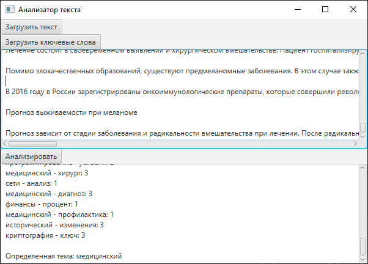
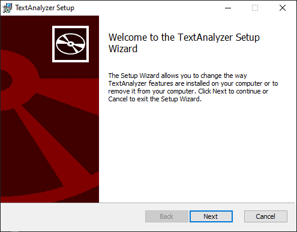
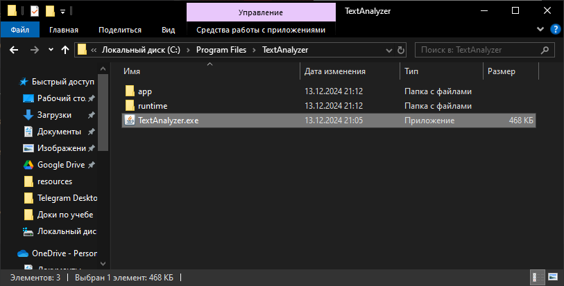

# Проект Анализатор Текста

Этот проект представляет собой приложение для анализа текста, которое определяет тематику текста на основе заранее заданных наборов ключевых слов. Он предоставляет как графический пользовательский интерфейс (GUI), так и интерфейс командной строки (CLI) для анализа текста. Проект использует библиотеку `log4j` для логирования как в консоль, так и в файл.

## Особенности

- **Обнаружение Темы на Основе Ключевых Слов**: Приложение определяет тематику текста, сопоставляя его с заранее заданными ключевыми словами.
- **Графический Пользовательский Интерфейс (GUI)**: Удобный интерфейс, созданный с использованием JavaFX, который позволяет загружать текстовые файлы и ключевые слова для анализа.
- **Интерфейс Командной Строки (CLI)**: Простой инструмент командной строки для загрузки текстовых файлов и выполнения анализа.
- **Логирование**: Все действия логируются как в консоль, так и в файл логов (`app.log`) с использованием библиотеки `log4j`.
- Поддержка сборки самодостаточного пакета с помощью **jlink** и **jpackage**.
## Требования

- Java 8 или выше
- Gradle (для сборки и управления зависимостями)
- JavaFX (для GUI)

## Установка

### 1. Клонирование Репозитория

Клонируйте репозиторий на свою локальную машину:

```bash
git@github.com:lanovich/textAnalyzer.git
cd text-analyzer
```

### 2. Сборка Проекта с помощью Gradle

Запустите команду для сборки проекта:

```bash
./gradlew build
```

## Скриншоты



## Запуск Приложения

### Использование Интерфейса Командной Строки (CLI)

Запустите класс TextAnalyzer для выполнения анализа:
```bash
./gradlew run
```
Использование Графического Интерфейса (GUI)
### Создание установщика и запуск приложения

Для того чтобы создать минимальную самодостаточную JDK для вашего приложения, выполните следующую команду:
```bash
./gradlew jlink
```

Для создания инсталлятора с помощью jpackage, выполните следующую команду:
```bash
./gradlew jpackage
```
После этого в **build/jpackage** вы можете найти установщик TextAnalyzer-1.0.0.exe.

Сохраните его себе на компьютер, откройте установщик и пройдите процесс установки.


Найдите установленное приложение на своем компьютере и откройте его.


## Логирование
Логи сохраняются в файл **logs/application.log**. Файл логов содержит информацию о действиях приложения, включая загрузку файлов, анализ текста и возможные ошибки.

Вывод в консоль отображает логи в реальном времени.

Файл application.log содержит записи обо всех логах во время работы приложения.

Логи включают следующие уровни:

- INFO: Общая информация о состоянии приложения и процессе.
- DEBUG: Подробная информация, полезная для отладки.
- WARN: Предупреждения о потенциальных проблемах.
- ERROR: Ошибки, возникшие при выполнении.

## Формат Файла с Ключевыми Словами
Файл с ключевыми словами (keywords.txt) должен иметь следующий формат:
```php
<тематика>=<ключевое_слово1, ключевое_слово2, ...>
```
Например:
```
Технологии=компьютер, искусственный интеллект, программирование, софт
Спорт=футбол, баскетбол, теннис, фитнес
```
Каждая тематика ассоциируется с набором ключевых слов, разделённых запятыми.

В качестве файла с ключевыми словами вы можете сохранить себе **keywords.txt** из папки public

## Зависимости
Проект использует следующие зависимости:

- **log4j2**: Для логирования.
- **JavaFX**: Для создания графического интерфейса.
- Эти зависимости управляются через **Gradle**.

## Структура Проекта
```bash
text-analyzer/
├── build.gradle          # Конфигурация сборки Gradle
├── gradle/               # Обёртка Gradle
├── src/                  # Исходный код
│   ├── main/
│   │   ├── java/         # Исходный код Java
│   │   └── resources/    # Файлы конфигурации (log4j2.xml)
│   └── test/             # Исходный код тестов
├── public/
│   └── keywords.txt      # Пример файла с ключевыми словами
└── logs/                 # Каталог логов
    └── application.log   # Логи приложения
